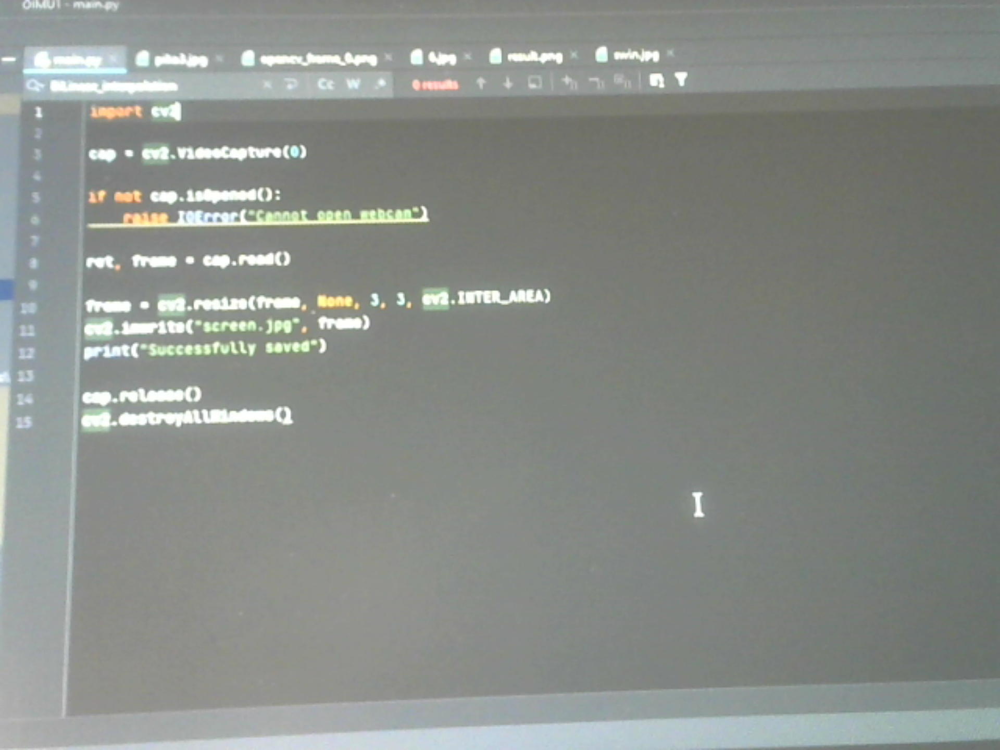
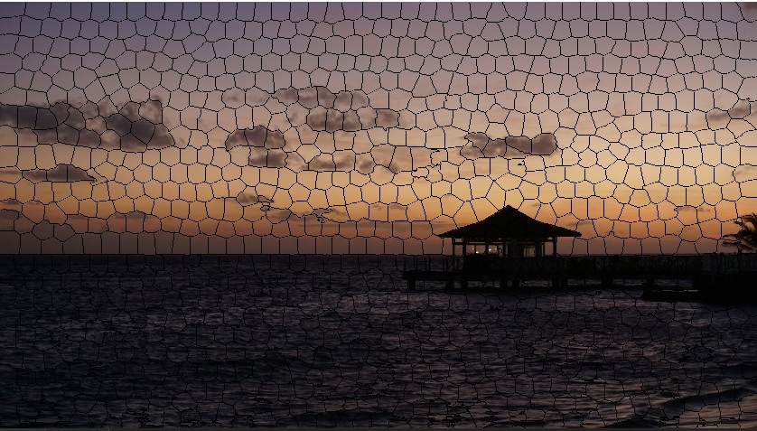
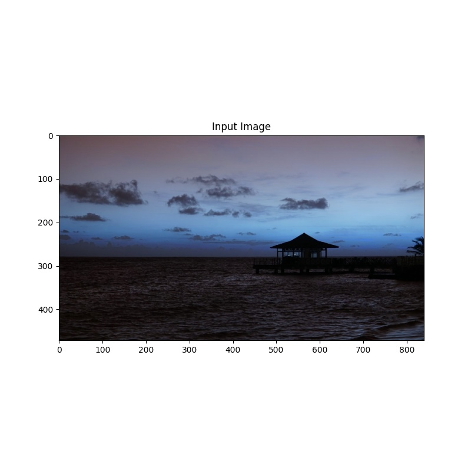

## Лабораторная работа 1. Получение изображений. Работа с RAW изображениями. Дебайеризация. Библиотеки работы с изображениями

План работ:
1. Подготовка среды программирования 
1. Поиск библиотек для работы с изображениями (OpenCV, Scikit-Image, Scipy, Python Image Library (Pillow/PIL), Matplotlib, SimpleITK, Numpy, Mahotas, Сolour)
1. Чтение изображений с камеры устройства
``` python
import cv2

cap = cv2.VideoCapture(0)

if not cap.isOpened():
	raise IOError("Cannot open webcam")

ret, frame = cap.read()

frame = cv2.resize(frame, None, 3, 3, cv2.INTER_AREA)
cv2.imwrite("screen.jpg", frame)
print("Successfully saved")

cap.release()
cv2.destroyAllWindows()

```



1. Создание алгоритма "байеризации"

``` java
    public BufferedImage bayer(BufferedImage bufferedImage) throws IOException {
        BufferedImage result = new BufferedImage(bufferedImage.getWidth(), bufferedImage.getHeight(), TYPE_INT_ARGB);
        int bg = 255;
        IntStream.range(0, result.getHeight()).forEach(y ->
                IntStream.range(0, result.getWidth()).forEach(x -> {
                    if (y % 2 == 0) { //rows 0 and 2
                        if (x % 2 == 0) { //only red
                            result.setRGB(x, y, color(ch1(bufferedImage.getRGB(x, y)), bg, bg, bg));
                        } else { //only green
                            result.setRGB(x, y, color(ch2(bufferedImage.getRGB(x, y)), bg, bg, bg));
                        }
                    } else { //rows 1 and 3
                        if (x % 2 == 0) { //only green
                            result.setRGB(x, y, color(ch2(bufferedImage.getRGB(x, y)), bg, bg, bg));
                        } else { //only blue
                            result.setRGB(x, y, color(ch3(bufferedImage.getRGB(x, y)), bg, bg, bg));
                        }
                    }
                })
        );
        save(result, "result/1lab", "bayerRes", "png");
        return result;
    }
``` 


  
3. Реализация суперпикселей. Аналоги библиотек
``` java
    public BufferedImage superPixel(BufferedImage bufferedImage) throws IOException {
        BufferedImage result = new BufferedImage(bufferedImage.getWidth() / 2, bufferedImage.getHeight() / 2, TYPE_INT_RGB);

        for(int y=0; y< result.getHeight();y++){
            for(int x=0; x< result.getWidth();x++){
                int r = alpha(bufferedImage.getRGB(x * 2, y * 2));
                int g = (alpha(bufferedImage.getRGB(x * 2 + 1, y * 2)) +
                        alpha(bufferedImage.getRGB(x * 2, y * 2 + 1))) / 2;
                int b = alpha(bufferedImage.getRGB(x * 2 + 1, y * 2 + 1));

                result.setRGB(x, y, color(r, g, b));
            }
        }

        save(result, "result/superPixel", "res", "png");
        return result;
    }
```

3. Реализация билинейной интерполяции. Аналоги библиотек

``` java
    public BufferedImage biLinear(BufferedImage bufferedImage) throws IOException {
        BufferedImage result = new BufferedImage(bufferedImage.getWidth(), bufferedImage.getHeight(), TYPE_INT_RGB);

        IntStream.range(1, result.getHeight() - 1).forEach(  y ->
                IntStream.range(1, result.getWidth() - 1).forEach( x -> {
            if (y % 2 == 0) { //rows 0 and 2
                if (x % 2 == 0) { //only red
                    int r = alpha(bufferedImage.getRGB(x, y));
                    int g = (alpha(bufferedImage.getRGB(x, y - 1)) +
                            alpha(bufferedImage.getRGB(x + 1, y)) +
                            alpha(bufferedImage.getRGB(x, y + 1)) +
                            alpha(bufferedImage.getRGB(x - 1, y))) / 4;
                    int b = (alpha(bufferedImage.getRGB(x - 1, y - 1)) +
                            alpha(bufferedImage.getRGB(x + 1, y - 1)) +
                            alpha(bufferedImage.getRGB(x - 1, y + 1)) +
                            alpha(bufferedImage.getRGB(x + 1, y + 1))) / 4;
                    result.setRGB(x, y, color(r, g, b));
                } else { //only green
                    int r = (alpha(bufferedImage.getRGB(x - 1, y)) +
                            alpha(bufferedImage.getRGB(x + 1, y))) / 2;
                    int g = alpha(bufferedImage.getRGB(x, y));
                    int b = (alpha(bufferedImage.getRGB(x, y - 1)) +
                            alpha(bufferedImage.getRGB(x, y + 1))) / 2;
                    result.setRGB(x, y, color(r, g, b));
                }
            } else { //rows 1 and 3
                if (x % 2 == 0) { //only green
                    int r = (alpha(bufferedImage.getRGB(x, y - 1)) +
                            alpha(bufferedImage.getRGB(x, y + 1))) / 2;
                    int g = alpha(bufferedImage.getRGB(x, y));
                    int b = (alpha(bufferedImage.getRGB(x - 1, y)) +
                            alpha(bufferedImage.getRGB(x + 1, y))) / 2;
                    result.setRGB(x, y, color(r, g, b));
                } else { //only blue
                    int r = (alpha(bufferedImage.getRGB(x - 1, y - 1)) +
                            alpha(bufferedImage.getRGB(x + 1, y - 1)) +
                            alpha(bufferedImage.getRGB(x - 1, y + 1)) +
                            alpha(bufferedImage.getRGB(x + 1, y + 1))) / 4;
                    int g = (alpha(bufferedImage.getRGB(x, y - 1)) +
                            alpha(bufferedImage.getRGB(x + 1, y)) +
                            alpha(bufferedImage.getRGB(x, y + 1)) +
                            alpha(bufferedImage.getRGB(x - 1, y))) / 4;
                    int b = alpha(bufferedImage.getRGB(x, y));
                    result.setRGB(x, y, color(r, g, b));
                }
            }
                })
        );

        save(result, "result/interp", "interpres", "png");
        return result;
    }
```


3. Реализация алгоритма VNG. Аналоги библиотек
``` java
    public void vng(BufferedImage bufferedImage) throws IOException {
        BufferedImage result = new BufferedImage(bufferedImage.getWidth(), bufferedImage.getHeight(), TYPE_INT_RGB);
        List<Integer> xPattern = Arrays.asList(1,3,5,7);
        List<Integer> colPattern = Arrays.asList(0,4);
        List<Integer> rowPattern = Arrays.asList(2,6);
        List<Integer> plusPattern = Arrays.asList(0,2,4,6);

        IntStream.range(2, result.getHeight() - 2).forEach( y ->
                IntStream.range(2, result.getWidth() - 2).forEach (x ->{
                    try {
                        int[][] gr = {
                                {bufferedImage.getRGB(x, y - 1), bufferedImage.getRGB(x, y - 2),
                                        bufferedImage.getRGB(x + 1, y - 2)},
                                {bufferedImage.getRGB(x + 1, y - 1), bufferedImage.getRGB(x + 2, y - 2),
                                        bufferedImage.getRGB(x + 2, y - 1)},
                                {bufferedImage.getRGB(x + 1, y), bufferedImage.getRGB(x + 2, y),
                                        bufferedImage.getRGB(x + 2, y + 1)},
                                {bufferedImage.getRGB(x + 1, y + 1), bufferedImage.getRGB(x + 2, y + 2),
                                        bufferedImage.getRGB(x + 1, y + 2)},
                                {bufferedImage.getRGB(x, y + 1), bufferedImage.getRGB(x, y + 2),
                                        bufferedImage.getRGB(x - 1, y + 2)},
                                {bufferedImage.getRGB(x - 1, y + 1), bufferedImage.getRGB(x - 2, y + 2),
                                        bufferedImage.getRGB(x - 2, y + 1)},
                                {bufferedImage.getRGB(x - 1, y), bufferedImage.getRGB(x - 2, y),
                                        bufferedImage.getRGB(x - 2, y - 1)},
                                {bufferedImage.getRGB(x - 1, y - 1), bufferedImage.getRGB(x - 2, y - 2),
                                        bufferedImage.getRGB(x - 1, y - 2)}
                        };
                        int threshold = 0;
                        for(int i1 = 0; i1<gr.length;i1++){
                            for (int j1 = 0; j1<gr[0].length; j1++){
                                threshold +=alpha(gr[i1][j1]);
                            }
                        }
                        threshold /= 19;
                        List<Integer> red = new ArrayList<>();
                        List<Integer> green = new ArrayList<>();
                        List<Integer> blue = new ArrayList<>();

                        if (y % 2 == 0) {
                            if (x % 2 == 0) {
                                red.add(alpha(bufferedImage.getRGB(x, y)));
                            } else { //only green
                                green.add(alpha(bufferedImage.getRGB(x, y)));
                            }
                        } else {
                            if (x % 2 == 0) {
                                green.add(alpha(bufferedImage.getRGB(x, y)));
                            } else {
                                blue.add(alpha(bufferedImage.getRGB(x, y)));
                            }
                        }

                        for (int i=0;i<gr.length;i++) {
                            int grVar = 0;
                            for (int j = 0; j < gr[i].length; j++) {
                                grVar += alpha(gr[i][j]);
                            }
                            if(grVar/gr[i].length <= threshold)
                            {
                                if (y % 2 == 0) { //rows 0 and 2
                                    if (x % 2 == 0)  { //X blue, + green\
                                        if(xPattern.contains(i)){blue.add(alpha(gr[i][0]));}
                                        else
                                        if(plusPattern.contains(i)){green.add(alpha(gr[i][0]));}

                                    } else  { // | blue, -- red, X green

                                        if(colPattern.contains(i)){blue.add(alpha(gr[i][0]));}
                                        else

                                        if(rowPattern.contains(i)){red.add(alpha(gr[i][0]));}
                                        else
                                        if(xPattern.contains(i)){green.add(alpha(gr[i][0]));}

                                    }
                                } else { //rows 1 and 3
                                    if (x % 2 == 0)  { // | red, -- blue, X green
                                        if(colPattern.contains(i)){red.add(alpha(gr[i][0]));}
                                        else
                                        if(rowPattern.contains(i)){blue.add(alpha(gr[i][0]));}
                                        else
                                        if(xPattern.contains(i)){green.add(alpha(gr[i][0]));}

                                    } else  { // X red, + green
                                        if(xPattern.contains(i)){red.add(alpha(gr[i][0]));}
                                        else
                                        if(plusPattern.contains(i)){green.add(alpha(gr[i][0]));}

                                    }
                                }
                            }
                            //   grVar=0;
                        }
                        int r,g,b;
                        if (red.size() == 0) r=0;
                        else {
                            r= sumRGB(red) / red.size();
                        }
                        if (green.size() == 0) g=0;
                        else {
                            g= sumRGB(green) / green.size();
                        }
                        if (blue.size() == 0) b=0;
                        else {
                            b= sumRGB(blue) / blue.size();
                        }

                        result.setRGB(x, y, color(r, g, b));

                    } catch (Exception e){
                        result.setRGB(x, y, color(4,244,4));
                    }
                })
        );
        save(result, "result/vng", "res", "jpg");
    }
```




Библиотка:

``` java

   public void lib(BufferedImage bufferedImage, int type) throws IOException {
        int height = bufferedImage.getHeight();
        int width = bufferedImage.getWidth();
        Mat mat = new Mat(height, width, CvType.CV_8U);
        IntStream.range(0, height).forEach( y ->
                IntStream.range(0, width).forEach(  x ->

                    mat.put(y, x, (alpha(bufferedImage.getRGB(x, y)))& 0xFF )

                ));
        Mat coloredMat = new Mat();
        Imgproc.cvtColor(mat, coloredMat, type);
       BufferedImage result = new BufferedImage(width, height, TYPE_INT_RGB);
        IntStream.range(0, height).forEach( y ->
                IntStream.range(0, width).forEach( x -> {
                            byte[] ch = new byte[]{0, 0, 0};
                            coloredMat.get(y, x, ch);
                            result.setRGB(x, y, color(ch[0], ch[1], ch[2]));
                        }));
       save(result, "result/libvng", "res", "png");

    }
    
    //вызов
            m.lib(b, Imgproc.COLOR_BayerBG2RGB);
            m.lib(b, Imgproc.COLOR_BayerBG2RGB_VNG);
    
```

