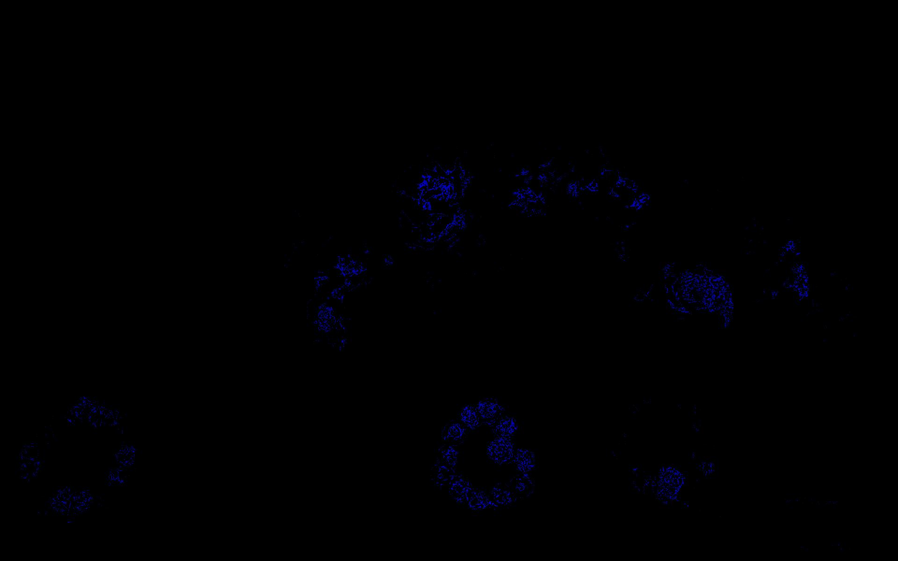

# Лабораторная работа 2. Переход между цветовыми пространствами. Линейный и нелинейный переход. Мера цветовой разницы. Функции преобразования яркости. Гамма, логарифмическое, экспоненциаяльное кодирование.
План работ:

1. Скачать любое цифровое изображение. Желательно многоцветное
    Исходное изображение:
    
1. Отобразить изображение по каналам RGB (каждый канал представить как градации серого).
``` java
    int h = img.getHeight();
    int w = img.getWidth();
    BufferedImage chR = new BufferedImage(w, h, TYPE_INT_RGB);
    BufferedImage chG = new BufferedImage(w, h, TYPE_INT_RGB);
    BufferedImage chB = new BufferedImage(w, h, TYPE_INT_RGB);
    for (int y = 0; y < h; y++) {
        for (int x = 0; x < w; x++) {
            int rgb = img.getRGB(x, y);
            int red = red(rgb);
            int green = green(rgb);
            int blue = blue(rgb);
            chR.setRGB(x, y, rgb(red, red, red));
            chG.setRGB(x, y, rgb(green, green, green));
            chB.setRGB(x, y, rgb(blue, blue, blue));
        }
    }
    .....
    private static int red(int rgb) { return (rgb & 0xff0000) >> 16; }
    private static int green(int rgb) {  return (rgb & 0xff00) >> 8;}
    private static int blue(int rgb) {    return rgb & 0xff; }

```
Результат: 

- Red:
 
- Green:
 
- Blue:
 


1. Лианеризовать изображение обратным гамма преобразованием.

``` java
    public BufferedImage gammaCorrection(BufferedImage img, double gamma) throws IOException {
        int height = img.getHeight();
        int width = img.getWidth();
        BufferedImage result = new BufferedImage(width, height, TYPE_INT_RGB);
        int[] gammacor = new int[256];
        for (int i = 0; i < gammacor.length; i++) {
            gammacor[i] = (int) (255 * (Math.pow(i / 255f, 1 / gamma))); //0.5
        }
        for (int y = 0; y < height; y++) {
            for (int x = 0; x < width; x++) {
                int rgb = img.getRGB(x, y);
                int red = gammacor[red(rgb)];
                int green = gammacor[green(rgb)];
                int blue = gammacor[blue(rgb)];
                result.setRGB(x, y, rgb(red, green, blue));
            }
        }
```
 

1. Отобразить по каналам RGB.
``` java
public void rgbChannels(BufferedImage img) throws IOException {
    int h = img.getHeight();
    int w = img.getWidth();
    BufferedImage chR = new BufferedImage(w, h, TYPE_INT_RGB);
    BufferedImage chG = new BufferedImage(w, h, TYPE_INT_RGB);
    BufferedImage chB = new BufferedImage(w, h, TYPE_INT_RGB);
    for (int y = 0; y < h; y++) {
        for (int x = 0; x < w; x++) {
            int rgb = img.getRGB(x, y);
            int red = red(rgb);
            int green = green(rgb);
            int blue = blue(rgb);
            chR.setRGB(x, y, rgb(red, 0, 0));
            chG.setRGB(x, y, rgb(0, green, 0));
            chB.setRGB(x, y, rgb(0, 0, blue));
        }
    }

}
```
 - R
 
 - G
 
 - B
 
 
1. Отобразить поканально разницу между исходным изображением и линеаризованным.

``` java
private void difference(BufferedImage img, BufferedImage gCor) throws IOException {
    int h = img.getHeight();
    int w = img.getWidth();
    BufferedImage chR = new BufferedImage(w, h, TYPE_INT_RGB);
    BufferedImage chG = new BufferedImage(w, h, TYPE_INT_RGB);
    BufferedImage chB = new BufferedImage(w, h, TYPE_INT_RGB);
    for (int y = 0; y < h; y++) {
        for (int x = 0; x < w; x++) {
            int orig = img.getRGB(x, y);
            int corr = gCor.getRGB(x, y);
            int red = red(orig) - red(corr);
            int green = green(orig) - green(corr);
            int blue = blue(orig) - blue(corr);
            chR.setRGB(x, y, rgb(red, 0, 0));
            chG.setRGB(x, y, rgb(0, green, 0));
            chB.setRGB(x, y, rgb(0, 0, blue));
        }
    }
    ...
}
```
- R

- G

- B


1. Написать функцию перевода цветов из линейного RGB в XYZ с использованием матрицы. Найти подходящую библиотечную функцию. Сравнить результаты через построение разностного изоборажения.

``` java
    public BufferedImage RGBtoXYZ(BufferedImage img) throws IOException {
        //opencv
        Mat xyzMat = new Mat();
        Imgproc.cvtColor(img2Mat(img), xyzMat, Imgproc.COLOR_BGR2XYZ);
        BufferedImage resultL = (BufferedImage) HighGui.toBufferedImage(xyzMat);

        int h = img.getHeight();
        int w = img.getWidth();
        BufferedImage result = new BufferedImage(w, h, TYPE_INT_RGB);
        for (int i = 0; i < h; i++) {
            for (int j = 0; j < w; j++) {
                int rgb = img.getRGB(j, i);
                int[] xyz = RGBtoXYZ(ch1(rgb), ch2(rgb), ch3(rgb));
                result.setRGB(j, i, color(xyz[2], xyz[1], xyz[0]));
            }
        }
///
        return result;
    }
    private static int[] RGBtoXYZ(double r, double g, double b) {

         double[][] M = {{0.4124, 0.3576,  0.1805},
                {0.2126, 0.7152,  0.0722},
                {0.0193, 0.1192,  0.9505}};
        return new int[]{
                (int) Math.round(r * M[0][0]+ g * M[0][1]+ b * M[0][2]),
                (int) Math.round(r * M[1][0] + g * M[1][1] + b * M[1][2]),
                (int) Math.round(r * M[2][0] + g * M[2][1] + b * M[2][2])
        };
    }
```
* Ручное преобразование 

* OpenCV


Сравнение изображений: 
``` java
    private static BufferedImage Compare(BufferedImage firstImage, BufferedImage secondImage) {
        int h = firstImage.getHeight();
        int w = firstImage.getWidth();
        BufferedImage result = new BufferedImage(w, h, TYPE_INT_RGB);
        for (int i = 0; i < h; i++) {
            for (int j = 0; j < w; j++) {
                int colorA = firstImage.getRGB(j, i);
                int colorB = secondImage.getRGB(j, i);
                int r = ch1(colorA) - ch1(colorB);
                int g = ch2(colorA) - ch2(colorB);
                int b = ch3(colorA) - ch3(colorB);
                if
                    (r < 0) r = 0;
                else if
                    (r > 255) r = 255;
                if
                    (g < 0) g = 0;
                else if
                    (g > 255) g = 255;
                if
                    (b < 0) b = 0;
                else if
                    (b > 255) b = 255;
                result.setRGB(j, i, color(r, g, b));
            }
        }
        return result;
    }
```
* Разница


3. Написать функцию перевода цветов из XYZ в RGB (построить обратную матрицу XYZ в RGB). Преобразовать изображение XYZ в линейный RGB. Применить гамма преобразование. Сравнить результаты через построение разностного изоборажения.
``` java
    public BufferedImage XYZtoRGB(BufferedImage img) throws IOException {
        //lib
        Mat rgbMat = new Mat();
        Imgproc.cvtColor(img2Mat(img), rgbMat, Imgproc.COLOR_XYZ2BGR);
        BufferedImage resultL = (BufferedImage) HighGui.toBufferedImage(rgbMat);
        //custom
        int h = img.getHeight();
        int w = img.getWidth();
        BufferedImage result = new BufferedImage(w, h, TYPE_INT_RGB);
        for (int i = 0; i < h; i++) {
            for (int j = 0; j < w; j++) {
                int xyz = img.getRGB(j, i);
                int rgb = XYZtoRGB(ch3(xyz), ch2(xyz), ch1(xyz));
                result.setRGB(j, i, rgb);
            }
        }
        ....
    private static int XYZtoRGB(int x, int y, int z) {

        double[][] M = {{ 3.2406, -1.5372, -0.4986},
                {-0.9689,	1.8758,	 0.0415},
                { 0.0557, -0.2040,	 1.0570}};
        
        double r = x * M[0][0] + y *  M[0][1] + z *  M[0][2];
        double g = x *  M[1][0] + y *  M[1][1] + z *  M[1][2];
        double b = x *  M[2][0] + y *  M[2][1] + z *  M[2][2];
        return color(r, g, b);
    }
```
* Ручное преобразование 

* OpenCV

* Разница


5. Построить проекцию цветов исходного изображения на цветовой локус (плоскость xy).
``` java
    public void locus(BufferedImage img) throws IOException {
        int size = 1000;
        int xMove = (int) Math.round(0.2 * size) / 2;
        int yMove = (int) Math.round(0.5 * size) / 2;
        BufferedImage locus = new BufferedImage(size, size, TYPE_INT_RGB);
        for (int i = 0; i < img.getHeight(); i++) {
            for (int j = 0; j < img.getWidth(); j++) {
                int rgb = img.getRGB(j, i);
                int[] xyz = RGBtoXYZ(ch1(rgb), ch2(rgb), ch3(rgb));
                double sum = xyz[0] + xyz[1] + xyz[2];
                if (sum > 0) {
                    double nx = xyz[0] / sum;
                    double ny = xyz[1] / sum;
                    double nz = xyz[2] / sum;
                    int x = (int) Math.round((1 - ny - nz) * size) + xMove;
                    int y = (int) Math.round((1 - nx - nz) * size * -1) + size - yMove;
                    try {
                        locus.setRGB(x, y, rgb);
                    } catch (ArrayIndexOutOfBoundsException e) {
                    }
                }
            }
        }
```

7. Написать функцию перевода цветов из линейного RGB в HSV и обратно. Найти подходящую библиотечную функцию. Сравнить результаты через построение разностного изоборажения.

``` java
    public BufferedImage RGBtoHSV(BufferedImage img) throws IOException {
        //lib
        Mat hsvMat = new Mat();
        Imgproc.cvtColor(img2Mat(img), hsvMat, Imgproc.COLOR_BGR2HSV);
        BufferedImage resultL = (BufferedImage) HighGui.toBufferedImage(hsvMat);

        //custom
        int h = img.getHeight();
        int w = img.getWidth();
        BufferedImage result = new BufferedImage(w, h, TYPE_INT_RGB);
        for (int i = 0; i < h; i++) {
            for (int j = 0; j < w; j++) {
                int color = img.getRGB(j, i);

                double[] hsv = RGBtoHSV(ch1(color), ch2(color), ch3(color));
                result.setRGB(j, i, color(hsv[2], hsv[1], hsv[0]));
            }
        }
        ......

    private static double[] RGBtoHSV(int r, int g, int b) {
        List<Integer> arr = Arrays.asList(r, g, b);
        double min = Collections.min(arr);
        double v = Collections.max(arr);
        double s;
        if (v == 0) {
            s = 0;
        } else {
            s = 1 - min / v;
        }
        double h = 0;
        if (v == r) {
            h = 60 * (g - b) / (v - min);
        } else if (v == g) {
            h = 60 * (b - r) / (v - min) + 120;
        } else if (v == b) {
            h = 60 * (r - g) / (v - min) + 240;
        }
        if (h < 0) h += 360;
        return new double[]{h / 2, s * 255, v * 255};
    }
```


* Ручное преобразование 

* OpenCV

* Разница



``` java
    public BufferedImage HSVtoRGB(BufferedImage img) throws IOException {
        //lib
        Mat rgbMat = new Mat();
        Imgproc.cvtColor(img2Mat(img), rgbMat, Imgproc.COLOR_HSV2BGR);
        BufferedImage resultL = (BufferedImage) HighGui.toBufferedImage(rgbMat);
        
        //custom
        int h = img.getHeight();
        int w = img.getWidth();
        BufferedImage result = new BufferedImage(w, h, TYPE_INT_RGB);
        for (int i = 0; i < h; i++) {
            for (int j = 0; j < w; j++) {
                int color = img.getRGB(j, i);
                int rgb = HSVtoRGB(ch3(color), ch2(color), ch1(color));
                result.setRGB(j, i, rgb);
            }
        }
        ....

    public static int HSVtoRGB(float H, float S, float V) {
        float R, G, B;
        H /= 180f;
        S /= 255f;
        V /= 255f;
        if (S == 0) {
            R = V * 255;
            G = V * 255;
            B = V * 255;
        } else {
            float var_h = H * 6;
            if (var_h == 6) {
                var_h = 0;
            }
            int var_i = (int) Math.floor(var_h);
            float var_1 = V * (1 - S);
            float var_2 = V * (1 - S * (var_h - var_i));
            float var_3 = V * (1 - S * (1 - (var_h - var_i)));
            float var_r;
            float var_g;
            float var_b;
            if (var_i == 0) {
                var_r = V;
                var_g = var_3;
                var_b = var_1;
            } else if (var_i == 1) {
                var_r = var_2;
                var_g = V;
                var_b = var_1;
            } else if (var_i == 2) {
                var_r = var_1;
                var_g = V;
                var_b = var_3;
            } else if (var_i == 3) {
                var_r = var_1;
                var_g = var_2;
                var_b = V;
            } else if (var_i == 4) {
                var_r = var_3;
                var_g = var_1;
                var_b = V;
            } else {
                var_r = V;
                var_g = var_1;
                var_b = var_2;
            }
            R = var_r * 255;
            G = var_g * 255;
            B = var_b * 255;
        }
        return color(R, G, B);
    }
```


* Ручное преобразование 

* OpenCV

* Разница

