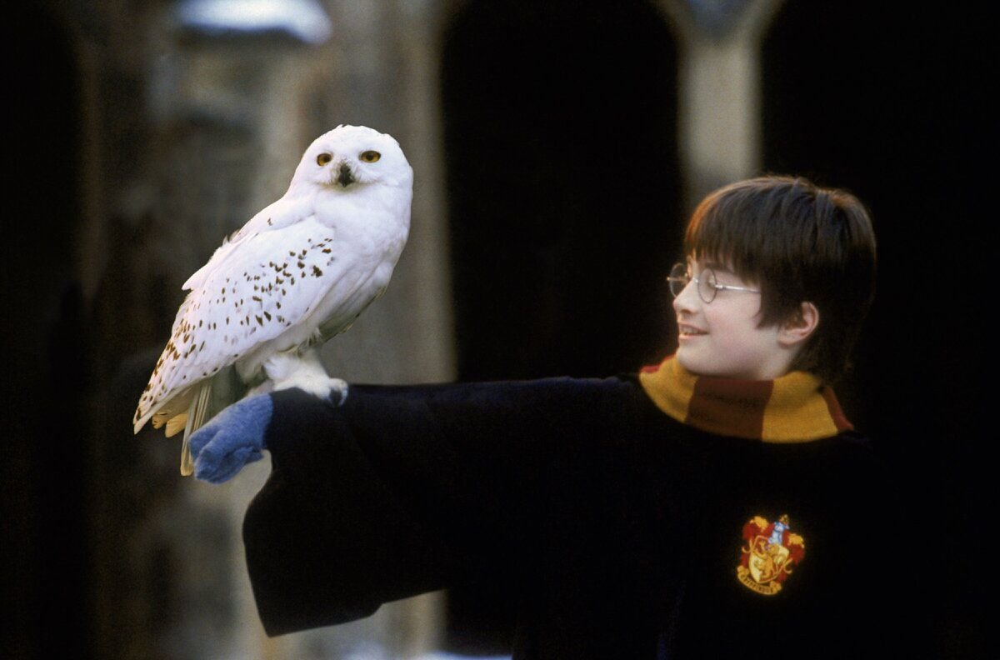
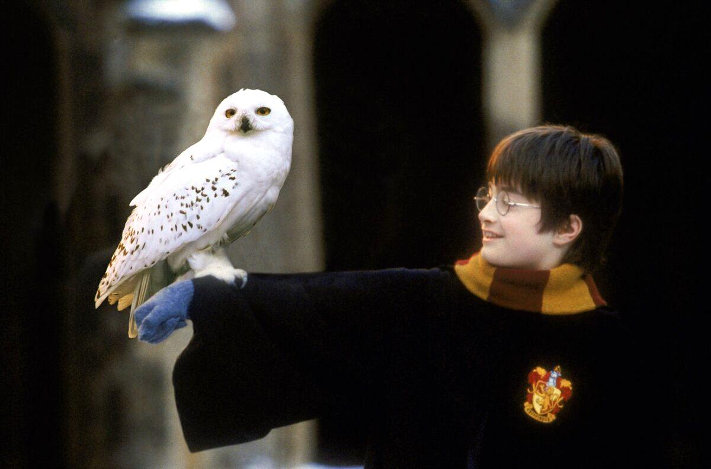
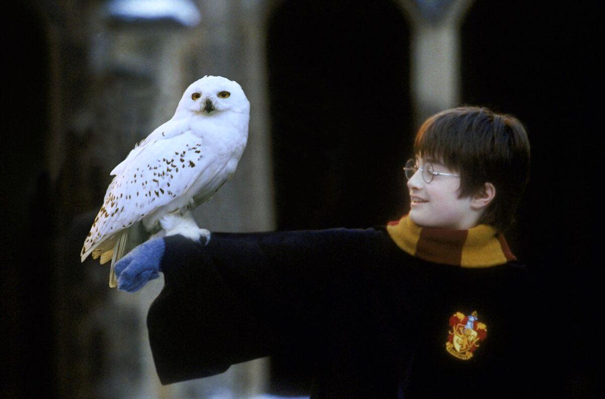

## Лабораторная работа 5. Баланс белого.

План работ:
1. Скачать цветное изображение по выбору с нарушенным цветовым балансом (желательно, чтобы на изображении был объект предположительно белого цвета).


2. Определить вручную цвет объекта, построить преобразование (матрицу 3х3) для коррекции белого.
 Применить к изображению. Не забудьте про нормировку яркости (если она будет нужна).

```
        int height = imgage.getHeight();
        int width = imgage.getWidth();
        BufferedImage result = new BufferedImage(width, height, TYPE_INT_RGB);
        
        float[][] matrix = {
                {255/226f, 0, 0},
                {0, 255/229f, 0},
                {0, 0, 255/238f}
        };
        
        for (int i = 0; i < height; i++) {
            for (int j = 0; j < width; j++) {
                int color = imgage.getRGB(j, i);
                int r = ch1(color);
                int g = ch2(color);
                int b = ch3(color);
                int balancedColor = color(
                        Math.round(r * matrix[0][0] + g * matrix[0][1] + b * matrix[0][2]),
                        Math.round(r * matrix[1][0] + g * matrix[1][1] + b * matrix[1][2]),
                        Math.round(r * matrix[2][0] + g * matrix[2][1] + b * matrix[2][2])
                );
                result.setRGB(j, i, balancedColor);
            }
        }
```



3. Исходное изображение скорректировать согласно теории Серого мира вручную.

```
        int height = image.getHeight();
        int width = image.getWidth();
        float avgRed = 0;
        float avgGreen = 0;
        float avgBlue = 0;
        for (int i = 0; i < height; i++) {
            for (int j = 0; j < width; j++) {
                int color = image.getRGB(j, i);
                avgRed = avgRed +ch1(color);
                avgGreen = avgGreen + ch2(color);
                avgBlue = avgBlue + ch3(color);
            }
        }
        float pixelCount = height*width;
        //средние яркости по всем каналам
        avgRed = avgRed/pixelCount;
        avgGreen = avgGreen/pixelCount;
        avgBlue = avgBlue/pixelCount;
        float avgGray = (avgRed+avgGreen+avgBlue)/3f;
        //коэффициенты для масштабирования
        float coefr = avgGray/avgRed;
        float coefg = avgGray/avgGreen;
        float coefb = avgGray/avgBlue;
        BufferedImage result = new BufferedImage(width, height, TYPE_INT_RGB);
        for (int i = 0; i < height; i++) {
            for (int j = 0; j < width; j++) {
                int color = image.getRGB(j, i);
                int r = Math.round(ch1(color)*coefr);
                if (r<0)
                    r=0;
                int g = Math.round(ch2(color)*coefg);
                if (g<0)
                    g=0;
                int b = Math.round(ch3(color)*coefb);
                if (b<0)
                    b=0;
                result.setRGB(j, i, color(r, g, b));
            }
        }
        
        ....
    public static int ch1(int color) { return (color & 0xff0000) >> 16; }
    public static int ch2(int color) {
        return (color & 0xff00) >> 8;
    }
    public static int ch3(int color) {
        return color & 0xff;
    }
```



4. Исходное изображение скорректировать согласно теории Серого мира при помощи библиотечной функции.

```
    private void grayWorldLib(BufferedImage img) throws IOException {
        Mat mat = new Mat();
        GrayworldWB alg = Xphoto.createGrayworldWB();
        alg.balanceWhite(img2Mat(img), mat);
        BufferedImage result = (BufferedImage) HighGui.toBufferedImage(mat);
        save(result, "result/grayWorldLib", "grayWorldLib", FORMAT);
    }

    private static Mat img2Mat(BufferedImage image) {
        image = convertTo3ByteBGR(image);
        byte[] data = ((DataBufferByte) image.getRaster().getDataBuffer()).getData();
        Mat mat = new Mat(image.getHeight(), image.getWidth(), CvType.CV_8UC3);
        mat.put(0, 0, data);
        return mat;
    }

    private static BufferedImage convertTo3ByteBGR(BufferedImage image) {
        BufferedImage convertedImage = new BufferedImage(image.getWidth(), image.getHeight(),
                BufferedImage.TYPE_3BYTE_BGR);
        convertedImage.getGraphics().drawImage(image, 0, 0, null);
        return convertedImage;
    }
```


7. Все результаты вывести на экран рядом для визуального сравнения.
